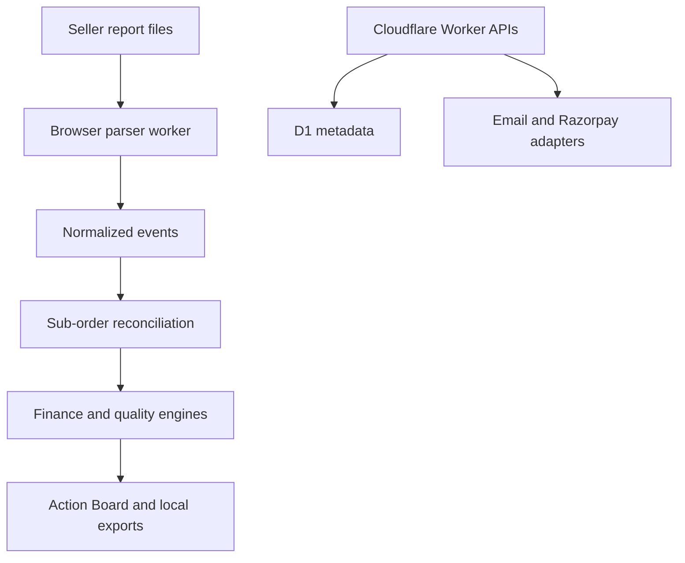

# Architecture

## Privacy boundary

Marketplace files are read by the browser and passed to a browser Web Worker. Parsed rows, SKU names, order identifiers and seller monetary values are never posted to the backend. Only account, entitlement, payment and optional summary metadata use Cloudflare APIs and D1.

The browser analysis path and the Cloudflare account/payment path are intentionally separate.

## Calculation pipeline

1. Detect report type from normalized header fingerprints.
2. Fail closed when critical mappings are ambiguous or missing.
3. Normalize source rows into marketplace-neutral events.
4. Deduplicate files and financial events.
5. Reconcile by the strongest sub-order identifier.
6. Attach seller costs and optional ad allocation.
7. Calculate contribution in integer paise.
8. Classify each result as confirmed, provisional or incomplete.
9. Run data-quality checks.
10. Generate deterministic, explainable actions.

## Versioning

Every analysis stores parser version, calculation engine version and anonymous source fingerprints. A parser change must keep historical golden fixtures passing or intentionally update the expected contract with a reviewed migration note.

## Backend boundary

The backend stores account/session metadata, payments, subscriptions, entitlements, seller-profile names, opted-in derived analysis summaries, alerts, blog/site configuration and support requests. SKU cost mappings and full analysis snapshots remain browser-local in IndexedDB. The backend must not store raw report files or full source rows.

## Extension points

- Add a report layout: update `core/parsers/aliases.ts`, then add a synthetic fixture and golden test.
- Add a marketplace later: create a new adapter that outputs the existing normalized entities; do not fork the finance engine.
- Add a decision rule: update the deterministic decision engine and add money-impact/sample-size tests.
- Add a payment provider: implement a server-only adapter with server signature verification and idempotent webhook storage.

## Ownership boundaries

- Client-generated analysis IDs are random, but server writes still enforce account ownership rather than treating an ID as authorization.
- A one-time entitlement token is bound to the actual entitlement row ID and analysis ID.
- A paid entitlement or payment with an established account owner is never silently reassigned during later verification.
- Guest one-time purchases remain possible; linking them to an account requires the signed entitlement token.

## Production runtime policy

The production deployment contains no synthetic public demo route, auto-seeded blog content or payment simulator. Synthetic fixtures remain only under `tests/` because they are deterministic verification assets, not user-facing product data.
